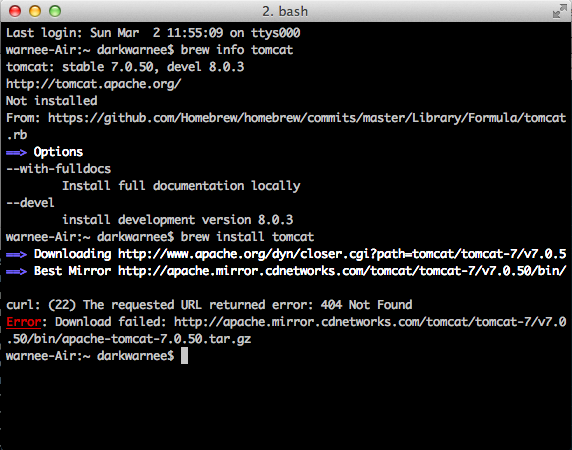
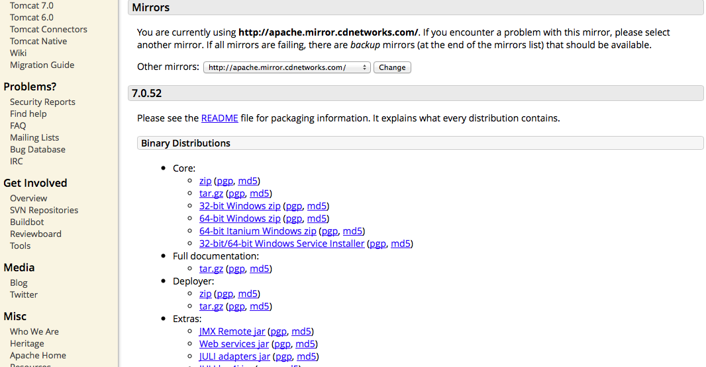
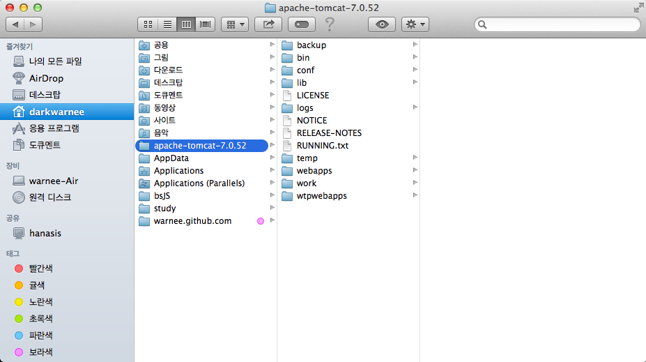
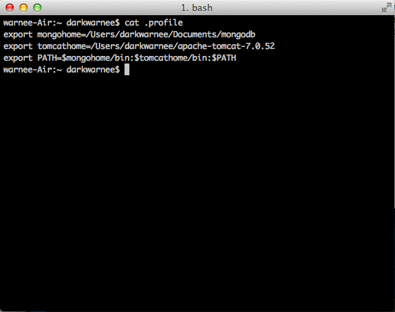
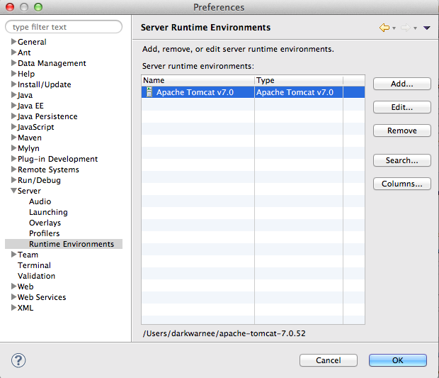
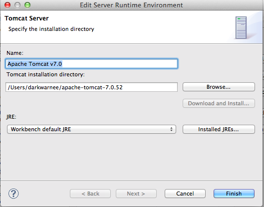
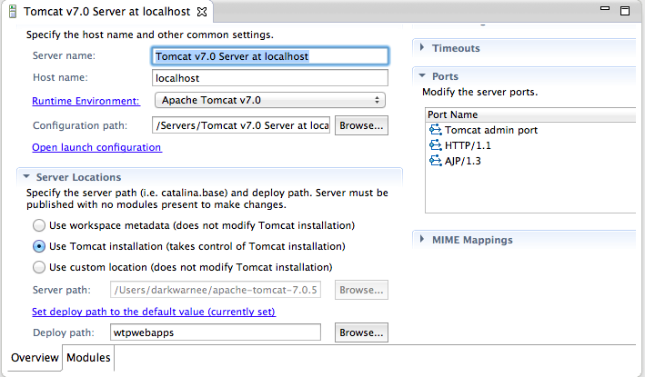

#TOMCAT

## tomcat 설치
### homebrew 이용
brew install tomcat  
왜인지 실패  

### 직접 설치
1. tomcat download

2. tomcat 압축해제후 원하는 위치로 이동

3. tomcat 설정(path등록) 

## 이클립스 연동

## 이클립스 연동후 확인 사항
### tomcat [메인 페이지](http://localhost:8080/)가 보이지 않는 경우

Server Locations 항목에서 Use Tomcat installation을 선택

